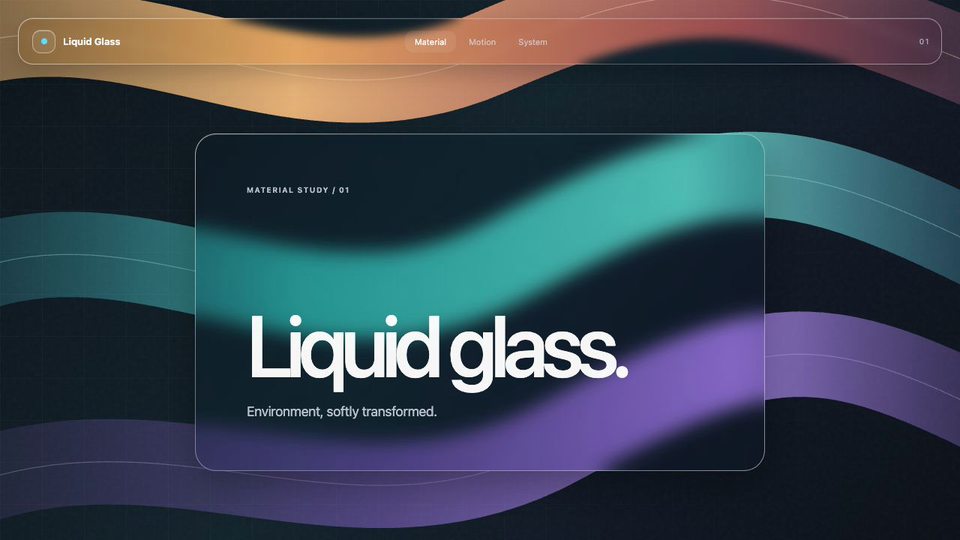

# Liquid Glass Web Design Skill

A self-contained Codex skill for designing, implementing, and reviewing coherent liquid-glass web interfaces.

This skill treats liquid glass as a complete design system rather than a translucent CSS effect. It connects the environment, optical materials, reusable components, interaction states, color roles, responsive composition, accessibility, and performance into one implementation model.

## Preview

[](demo/index.html)

This image is captured from the real, static [`demo/index.html`](demo/index.html) page. Three separated curved color bands provide a sharp environment behind a stable clear-glass tab bar and one minimal frosted card, keeping the demonstration focused on how the material transforms its backdrop.

## What it provides

- A precise definition of clear glass, frosted glass, and opaque fallback materials.
- Shared blur, edge, veil, radius, shadow, color, and motion tokens.
- Rules for cards, buttons, chips, inputs, menus, lists, metrics, status indicators, modals, and drawers.
- A decision matrix for card nesting, glass-over-glass, and glass-over-frosted composition.
- Explicit hover, focus-visible, pressed, selected, disabled, loading, success, and error states.
- Backdrop-aware text, accent, semantic color, and glow guidance.
- CSS, React, Vue, Svelte, and utility-CSS implementation patterns.
- Separate guidance for CSS optics, SVG displacement, WebGL refraction, and 3D glass.
- Visual, accessibility, responsive, and performance quality gates.
- A reusable CSS foundation with theme tokens and component recipes.

## Design principles

1. The environment remains sharp, visible, and compositionally useful.
2. Glass changes how the environment is perceived; it does not replace it with a painted rectangle.
3. Clear and frosted glass are reusable material variants shared by every component family.
4. Persistent optical depth stays shallow; unnecessary same-material card nesting is rejected.
5. Color and glow communicate selection, focus, or semantic state instead of decorating every edge.
6. Liquid appearance comes from restrained optics and state response, not permanent surface animation.
7. Responsive layout follows available component space, while advanced effects stay within a measured performance budget.

## Repository structure

The installable skill is isolated in a single directory. Repository-only documentation and previews stay outside that package.

| Path | Purpose |
|---|---|
| [`liquid-glass-web-design/`](liquid-glass-web-design/) | Complete installable skill directory |
| [`liquid-glass-web-design/SKILL.md`](liquid-glass-web-design/SKILL.md) | Skill entry point, workflow, routing, and non-negotiable constraints |
| [`liquid-glass-web-design/references/`](liquid-glass-web-design/references/) | Detailed design, implementation, and quality guidance |
| [`liquid-glass-web-design/assets/liquid-glass.css`](liquid-glass-web-design/assets/liquid-glass.css) | Reusable CSS tokens, materials, components, and states |
| [`liquid-glass-web-design/agents/openai.yaml`](liquid-glass-web-design/agents/openai.yaml) | Codex UI metadata and default invocation prompt |
| [`demo/index.html`](demo/index.html) | Runnable Liquid Glass homepage used as the preview source |
| [`demo/styles.css`](demo/styles.css) | Demo environment, composition, material use, and responsive behavior |
| [`demo/liquid-glass-preview.png`](demo/liquid-glass-preview.png) | Static browser capture of the material demo embedded above |

## Installation

Clone the repository, then link its standalone skill directory into Codex:

```bash
mkdir -p "${CODEX_HOME:-$HOME/.codex}/repos" "${CODEX_HOME:-$HOME/.codex}/skills"
git clone git@github.com:korilin/liquid-glass-web-design-skill.git \
  "${CODEX_HOME:-$HOME/.codex}/repos/liquid-glass-web-design-skill"
ln -sfn \
  "${CODEX_HOME:-$HOME/.codex}/repos/liquid-glass-web-design-skill/liquid-glass-web-design" \
  "${CODEX_HOME:-$HOME/.codex}/skills/liquid-glass-web-design"
```

Restart or refresh Codex skill discovery if the skill is not immediately visible.

To update an existing installation:

```bash
git -C "${CODEX_HOME:-$HOME/.codex}/repos/liquid-glass-web-design-skill" pull --ff-only
```

## Usage

Invoke the skill explicitly with `$liquid-glass-web-design`, or let Codex select it automatically for a matching web UI task.

```text
Use $liquid-glass-web-design to build a responsive analytics dashboard with a photographic environment, a frosted data rail, and clear-glass controls.
```

```text
Use $liquid-glass-web-design to refactor this React interface into shared clear and frosted material primitives without changing its business behavior.
```

```text
Use $liquid-glass-web-design to review this page for material, nesting, state, color, accessibility, and performance violations. Report root causes and shared fixes.
```

## CSS foundation

[`liquid-glass-web-design/assets/liquid-glass.css`](liquid-glass-web-design/assets/liquid-glass.css) can be copied into a project or translated into its existing design system. It includes dark and light tones, clear and frosted materials, shared component recipes, interaction states, fallbacks, and reduced-motion handling.

Minimal markup:

```html
<html data-lg-tone="dark">
  <link rel="stylesheet" href="/styles/liquid-glass.css">

  <section class="lg-card lg-material lg-stack" data-lg-material="frosted" data-lg-scale="card">
    <h2 class="lg-text-primary">Workspace</h2>
    <p class="lg-text-secondary">A shared frosted card recipe.</p>

    <div class="lg-cluster">
      <button class="lg-button lg-material" data-lg-material="clear">Action</button>
      <button class="lg-chip lg-material" data-lg-material="clear" data-lg-selected="true" aria-pressed="true">Selected</button>
      <span class="lg-status" data-lg-tone="success">Ready</span>
    </div>
  </section>
</html>
```

Treat the stylesheet as a reference foundation. When the target project already has tokens or components, merge the material roles into that system instead of maintaining two competing theme layers.

## Validation

Validate the standalone skill after changes:

```bash
python3 "${CODEX_HOME:-$HOME/.codex}/skills/.system/skill-creator/scripts/quick_validate.py" \
  liquid-glass-web-design
```

Also verify that all Markdown references resolve and render the CSS foundation over dark, bright, mixed, and low-detail backgrounds before changing shared optical tokens.
